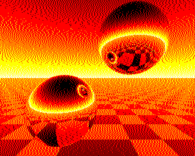
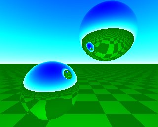

# Simple Forth Raytracer

This started off as a very naive port of a BBC Raytracer. 

Originally found here https://github.com/robogeek42/agon_basic_mycode/blob/main/rtdemo/HowDoesItWork.md
And here https://github.com/robogeek42/agon_basic_mycode/tree/main/rtdemo
But also see https://news.ycombinator.com/item?id=39023056
And https://bbcmic.ro/#%7B%22v%22%3A1%2C%22program%22%3A%22MODE1%3AVDU5%3AB%3D0%5CnFORN%3D8TO247%3AFORM%3D0TO319%5CnX%3D0%3AY%3D-.1%3AZ%3D3%3AU%3D%28M-159.5%29%2F160%3AV%3D%28N-127.5%29%2F160%3AW%3D1%2FSQR%28U*U%2BV*V%2B1%29%3AU%3DU*W%3AV%3DV*W%3AI%3DSGNU%3AG%3D1%5CnE%3DX-I%3AF%3DY-I%3AP%3DU*E%2BV*F-W*Z%3AD%3DP*P-E*E-F*F-Z*Z%2B1%3AIFD%3E0T%3D-P-SQRD%3AIFT%3E0X%3DX%2BT*U%3AY%3DY%2BT*V%3AZ%3DZ-T*W%3AE%3DX-I%3AF%3DY-I%3AG%3DZ%3AP%3D2*%28U*E%2BV*F-W*G%29%3AU%3DU-P*E%3AV%3DV-P*F%3AW%3DW%2BP*G%3AI%3D-I%3AGOTO40%5CnIFV%3C0P%3D%28Y%2B2%29%2FV%3AV%3D-V*%28%28INT%28X-U*P%29%2BINT%28Z-W*P%29AND1%29%2F2%2B.3%29%2B.2%5CnB%3DB%2B3*SQRV%3AGCOL0%2C3-INTB%3AB%3DB-INTB%5CnPLOT69%2C4*M%2C4*N%3ANEXT%2C%22%7D

## How it works

You should look at the code, especially start at the bottom at main. As well as comments in the code, the above links have a good amount of discussion about the algorithm.

It's substantially larger than the BBC BASIC version - but I've made no attempt for the verison in `raytrace.fth` to shrink the code, or make it more Forth-like. As I mentioned above, it's a very naive port - and over uses global variables to do parameter passing in the raytracer. 

There is also test code for things to test the BMP image export. 

There is a simple 24-bit bitmap save `write_bmp`, which is called with the filename ( caddr len -- ) as parameters.

## Higher Colour Version

See `raytrace_colour.fth`.

## License

Conversion itself licensed under the MIT License - however since this is a direct conversion of the original code, the original license would apply as well.  

I have not been able to find the original license - so that means that full copyright applies.  Contact the original author for permission to use the original code - for this file only. If you use the maths *concepts* only to create a simple renderer, then I think that is fair use and/or covered by known in the art.  If you use the original code, then you need to get permission.

NOTE: BMP converter is original code - so that is fully MIT licensed.

